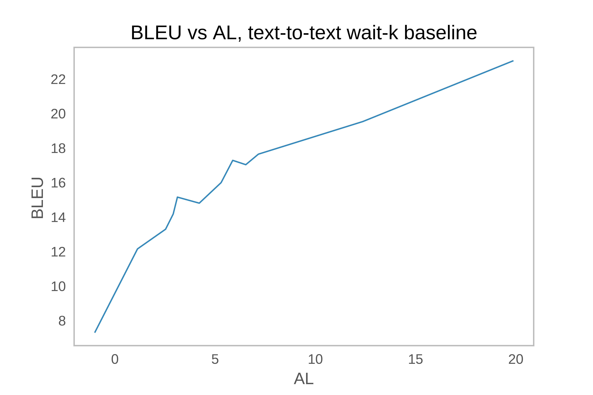

# **Baseline Simultaneous Translation**
---

Here are the instructions for training and evaluating a *wait-k* simultaneous LSTM model on the MUST-C English-German dataset.

[STACL: Simultaneous Translation with Implicit Anticipation and Controllable Latency using Prefix-to-Prefix Framework](https://https://www.aclweb.org/anthology/P19-1289/)


## **Requirements**
Install fairseq (make sure to use the correct branch):
```
git clone --branch simulastsharedtask git@github.com:pytorch/fairseq.git
cd fairseq
pip install -e .
```

Assuming that fairseq is installed in a directory called `FAIRSEQ`. We will use `$FAIRSEQ/example/simultaneous_translation` as the work directory

Install SentencePiece. One easy way is to use anaconda:

```
conda install -c powerai sentencepiece
```

Other requirements:
* yaml: `pip install pyyaml`
* tornado: `pip install tornado`
* vizseq: `pip install vizseq`
* soundfile: `pip install soundfile`
* torchaudio: `pip install torchaudio`

Download the MuST-C data for English-German available at https://ict.fbk.eu/must-c/.
In this example we will assume that the data is downloaded in a directory called ./experiments/data/must_c_1_0/en-de.

## **Text-to-text Model**
---
### Data Preparation
Train a SentencePiece model:
```shell
cd $FAIRSEQ/examples/simultaneous_translation
DATA_ROOT=./experiments/data/must_c_1_0/en-de
for lang in en de; do
    python $FAIRSEQ/examples/simultaneous_translation/data/train_spm.py \
        --data-path $DATA_ROOT/data \
        --vocab-size 10000 \
        --max-frame 3000 \
        --model-type unigram \
        --lang $lang \
        --out-path $DATA_ROOT
done
```

Process the data with the SentencePiece model:
```shell
mkdir -p $DATA_ROOT/bi-text
for split in train dev tst-COMMON tst-HE; do
    for lang in en de; do
        spm_encode \
            --model $DATA_ROOT/unigram-$lang-10000-3000/spm.model \
            < $DATA_ROOT/data/$split/txt/$split.$lang \
            > $DATA_ROOT/bi-text/$split.spm.$lang
    done
done
```

Binarize the data:

```shell
proc_dir=$DATA_ROOT/bi-text
fairseq-preprocess \
    --source-lang en --target-lang de \
    --trainpref $proc_dir/train.spm \
    --validpref $proc_dir/dev.spm \
    --testpref $proc_dir/tst-COMMON.spm \
    --thresholdtgt 0 \
    --thresholdsrc 0 \
    --workers 20 \
    --destdir $DATA_ROOT/data-bin/mustc_en_de
```

### Training

If you want to skip training and evaluate pre-trained models, you can go to the Evaluation section.


```shell
mkdir -p ./experiments/checkpoints
CUDA_VISIBLE_DEVICES=1 python $FAIRSEQ/train.py data-bin/mustc_en_de \
    --save-dir ./experiments/checkpoints \
    --arch berard_simul_text_iwslt \
    --simul-type waitk \
    --waitk-lagging 2 \
    --optimizer adam \
    --max-epoch 100 \
    --lr 0.001 \
    --clip-norm 5.0  \
    --max-sentences 128  \
    --log-format json \
    --log-interval 10 \
    --criterion cross_entropy_acc \
    --user-dir $FAIRSEQ/examples/simultaneous_translation
```

## **Speech-to-text Model**
---
### Data Preparation
First, segment wav files.
```shell 
cd $FAIRSEQ/example/simultaneous_translation
DATA_ROOT=./experiments/data/must_c_1_0/en-de
python $FAIRSEQ/examples/simultaneous_translation/data/segment_wav.py \
    --data-path $DATA_ROOT/data
```
Similar to text-to-text model, train a Sentencepiecemodel, but only train on German
```Shell
python $FAIRSEQ/examples/simultaneous_translation/data/train_spm.py \
    --data-path $DATA_ROOT/data \
    --vocab-size 10000 \
    --max-frame 3000 \
    --model-type unigram \
    --lang de \
    --out-path $DATA_ROOT
```
## Training
```shell
mkdir -p ./experiments/checkpoints
CUDA_VISIBLE_DEVICES=1 python $FAIRSEQ/train.py data-bin/mustc_en_de \
    --save-dir checkpoints \
    --arch berard_simul_text_iwslt \
    --waitk-lagging 2 \
    --waitk-stride 10 \
    --input-feat-per-channel 40 \
    --encoder-hidden-size 512 \
    --output-layer-dim 128 \
    --decoder-num-layers 3 \
    --task speech_translation \
    --user-dir $FAIRSEQ/examples/simultaneous_translation
    --optimizer adam \
    --max-epoch 100 \
    --lr 0.001 \
    --clip-norm 5.0  \
    --max-sentences 128  \
    --log-format json \
    --log-interval 10 \
    --criterion cross_entropy_acc \
    --user-dir $FAIRSEQ/examples/simultaneous_translation \
    --online-features
```

## Evaluation
---
### Evaluation Server
The server can evaluate different types of data given different configuration files
To evaluate text translation models on dev set. 

``` shell
./scripts/start-server.sh ./scripts/configs/must-c-en_de-text-dev.sh
```
To evaluate speech translation models on dev set.
``` shell
./scripts/start-server.sh ./scripts/configs/must-c-en_de-speech-dev.sh
```

### Decode and Evaluate with Client
Same as the server, one can use different configuration files to start different agent.
To evaluate text translation models on dev set. 
```shell
./scripts/start-client.sh \
    ./scripts/configs/must-c-en_de-speech-text.sh \
    ./experiments/checkpoints/checkpoint_best.pt
```
To evaluate speech translation models on dev set. 
```shell
./scripts/start-client.sh \
    ./scripts/configs/must-c-en_de-speech-dev.sh \
    ./experiments/checkpoints/checkpoint_best.pt
```

We also provide a faster evaluation script that splits the dataset and launches multiple clients. For example for speech translation,
```shell
./scripts/start-multi-client.sh \
    ./scripts/configs/must-c-en_de-speech-dev.sh \
    ./experiments/checkpoints/checkpoint_best.pt
```

### Pretrained models

You can use the client scripts with pre-trained models:
* [text model](https://dl.fbaipublicfiles.com/simultaneous_translation/checkpoint_text_waitk3.pt). You should obtain the following score: `Scores: {"BLEU": 13.291, "TER": 0.957, "METEOR": 0.31, "DAL": 4.372044027815046, "AL": 2.5295724889866804, "AP": 0.6400225334686246}`. This corresponds to `k = 3` in the wait-k model. You can see in the table and figure below the quality and latency metrics for various values of k. The corresponding checkpoints to download can be found at https://dl.fbaipublicfiles.com/simultaneous_translation/checkpoint_text_waitk$k.pt (replace `$k` with the corresponding value).

| k  | BLEU | TER | METEOR | DAL | AL | AP |
| -- | ---- | --- | ------ | --- | -- | -- |
| 1  | 7.33 | 1.06 | 0.19 | 2.17 | -0.99 | 0.47 |
| 2  | 12.15 | 0.97 | 0.28 | 3.25 | 1.13 | 0.57 |
| 3  | 13.29 | 0.96 | 0.31 | 4.37 | 2.53 | 0.64 |
| 4  | 14.17 | 0.99 | 0.32 | 4.86 | 2.91 | 0.67 |
| 5  | 15.15 | 0.82 | 0.33 | 5.30 | 3.12 | 0.68 |
| 6  | 14.80 | 0.96 | 0.33 | 6.19 | 4.21 | 0.73 |
| 7  | 15.99 | 0.96 | 0.34 | 7.04 | 5.30 | 0.77 |
| 8  | 17.28 | 0.87 | 0.35 | 7.52 | 5.88 | 0.79 |
| 9  | 17.03 | 0.92 | 0.36 | 8.17 | 6.53 | 0.81 |
| 10 | 17.64 | 0.95 | 0.36 | 8.77 | 7.16 | 0.83 |
| 20 | 19.53 | 0.84 | 0.39 | 13.55 | 12.37 | 0.94 |
| 1000 | 23.04 | 0.73 | 0.44 | 19.85 | 19.85 | 1.0 |



* [speech model](https://dl.fbaipublicfiles.com/simultaneous_translation/checkpoint_speech_waitk_lag5_stride10.pt). You should obtain the following scores: `{"BLEU": 10.785, "TER": 0.913, "METEOR": 0.247, "DAL": 2817.45349595572, "AL": 2331.9959397710254, "AP": 0.8462297623865175}`

### Final Evaluation with Docker
Our final evaluation will be run inside Docker. When submitting your final models, you need to provide the checkpoint
files and define its runtime environment in a Dockerfile. We provide an [example Dockerfile](../Dockerfile) for the
pretrained models above.

To run evaluation with Docker, first build a Docker image from the Dockerfile
```bash
docker build -t iwslt2020_simulast:latest .
```
and then run the Docker image
```bash
docker run --env CHKPT_FILENAME=checkpoint_text_waitk3.pt -v "$(pwd)"/experiments:/fairseq/experiments -it iwslt2020_simulast
```
