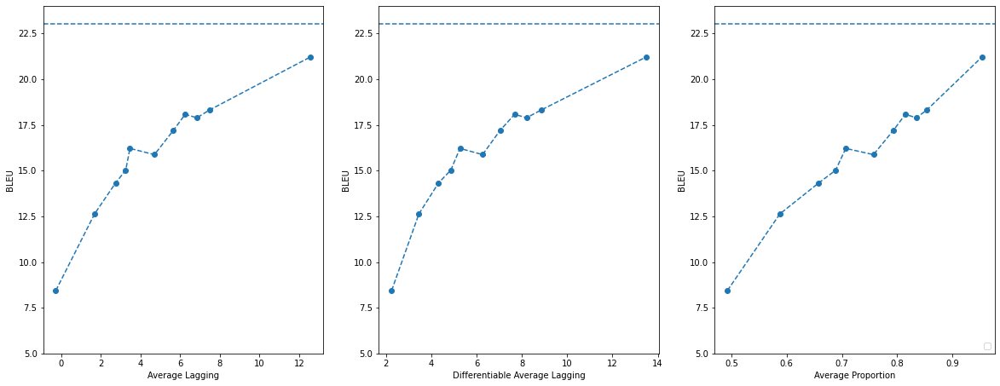
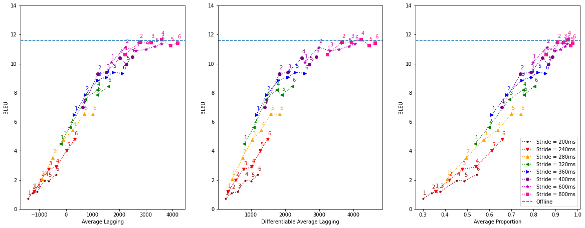

# **Baseline Simultaneous Translation**

Here are the instructions for training and evaluating a *wait-k* simultaneous LSTM model on the MUST-C English-German dataset.

[STACL: Simultaneous Translation with Implicit Anticipation and Controllable Latency using Prefix-to-Prefix Framework](https://https://www.aclweb.org/anthology/P19-1289/)


## **Requirements**
Install fairseq (make sure to use the correct branch):
```
git clone --branch simulastsharedtask git@github.com:pytorch/fairseq.git
cd fairseq
pip install -e .
```

Assuming that fairseq is installed in a directory called `FAIRSEQ`. We will use `$FAIRSEQ/example/simultaneous_translation` as the work directory

Install SentencePiece. One easy way is to use anaconda:

```
conda install -c powerai sentencepiece
```

Other requirements:
* yaml: `pip install pyyaml`
* tornado: `pip install tornado`
* vizseq: `pip install vizseq`
* soundfile: `pip install soundfile`
* torchaudio: `pip install torchaudio`

Download the MuST-C data for English-German available at https://ict.fbk.eu/must-c/.
In this example we will assume that the data is downloaded in a directory called ./experiments/data/must_c_1_0/en-de.

## **Text-to-text Model**
---
### Data Preparation
Train a SentencePiece model:
```shell
cd $FAIRSEQ/examples/simultaneous_translation
DATA_ROOT=./experiments/data/must_c_1_0/en-de
for lang in en de; do
    python $FAIRSEQ/examples/simultaneous_translation/data/train_spm.py \
        --data-path $DATA_ROOT/data \
        --vocab-size 10000 \
        --max-frame 3000 \
        --model-type unigram \
        --lang $lang \
        --out-path $DATA_ROOT
done
```

Process the data with the SentencePiece model:
```shell
mkdir -p $DATA_ROOT/bi-text
for split in train dev tst-COMMON tst-HE; do
    for lang in en de; do
        spm_encode \
            --model $DATA_ROOT/unigram-$lang-10000-3000/spm.model \
            < $DATA_ROOT/data/$split/txt/$split.$lang \
            > $DATA_ROOT/bi-text/$split.spm.$lang
    done
done
```

Binarize the data:

```shell
proc_dir=$DATA_ROOT/bi-text
fairseq-preprocess \
    --source-lang en --target-lang de \
    --trainpref $proc_dir/train.spm \
    --validpref $proc_dir/dev.spm \
    --testpref $proc_dir/tst-COMMON.spm \
    --thresholdtgt 0 \
    --thresholdsrc 0 \
    --workers 20 \
    --destdir $DATA_ROOT/data-bin/mustc_en_de
```

### Training

If you want to skip training and evaluate pre-trained models, you can go to the Evaluation section.


```shell
mkdir -p ./experiments/checkpoints
CUDA_VISIBLE_DEVICES=1 python $FAIRSEQ/train.py data-bin/mustc_en_de \
    --save-dir ./experiments/checkpoints \
    --arch berard_simul_text_iwslt \
    --simul-type waitk \
    --waitk-lagging 2 \
    --optimizer adam \
    --max-epoch 100 \
    --lr 0.001 \
    --clip-norm 5.0  \
    --max-sentences 128  \
    --log-format json \
    --log-interval 10 \
    --criterion cross_entropy_acc \
    --user-dir $FAIRSEQ/examples/simultaneous_translation
```

## **Speech-to-text Model**
---
### Data Preparation
First, segment wav files.
```shell 
cd $FAIRSEQ/example/simultaneous_translation
DATA_ROOT=./experiments/data/must_c_1_0/en-de
python $FAIRSEQ/examples/simultaneous_translation/data/segment_wav.py \
    --data-path $DATA_ROOT/data
```
Similar to text-to-text model, train a Sentencepiecemodel, but only train on German
```Shell
python $FAIRSEQ/examples/simultaneous_translation/data/train_spm.py \
    --data-path $DATA_ROOT/data \
    --vocab-size 10000 \
    --max-frame 3000 \
    --model-type unigram \
    --lang de \
    --out-path $DATA_ROOT
```
## Training
```shell
mkdir -p ./experiments/checkpoints
CUDA_VISIBLE_DEVICES=1 python $FAIRSEQ/train.py data-bin/mustc_en_de \
    --save-dir checkpoints \
    --arch berard_simul_text_iwslt \
    --waitk-lagging 2 \
    --waitk-stride 10 \
    --input-feat-per-channel 40 \
    --encoder-hidden-size 512 \
    --output-layer-dim 128 \
    --decoder-num-layers 3 \
    --task speech_translation \
    --user-dir $FAIRSEQ/examples/simultaneous_translation
    --optimizer adam \
    --max-epoch 100 \
    --lr 0.001 \
    --clip-norm 5.0  \
    --max-sentences 128  \
    --log-format json \
    --log-interval 10 \
    --criterion cross_entropy_acc \
    --user-dir $FAIRSEQ/examples/simultaneous_translation \
    --online-features
```

## Evaluation
---
### Evaluation Server
The server can evaluate different types of data given different configuration files.
We provide the configuration files for dev and test split (`SPLIT in [dev, test]`).
To evaluate text translation models on a given split set. 

``` shell
python -u $FAIRSEQ/examples/simultaneous_translation/eval/server.py \
    --tokenizer 13a \
    --src-file ./experiments/data/must_c_1_0/en-de/data/${SPLIT}/txt/${SPLIT}.en\
    --tgt-file ./experiments/data/must_c_1_0/en-de/data/${SPLIT}/txt/${SPLIT}.de \
    --scorer-type text \
    --output ./experiments/result_dir/eval/text \
    --port 12321
```
To evaluate speech translation models on a given split set. 
Only `--tgt-file` (a json file) is needed for speech server.
``` shell
python -u $FAIRSEQ/examples/simultaneous_translation/eval/server.py \
    --tokenizer 13a \
    --tgt-file ./experiments/data/must_c_1_0/en-de/unigram-de-10000-3000/${SPLIT}.json \
    --scorer-type speech \
    --output ./experiments/result_dir/eval/speech \
    --port 12321
```

### Decode and Evaluate with Client
Same as the server, one can use different configuration files to start different agent.
To evaluate text translation models on a given split set. 
```shell
./scripts/start-client.sh \
    ./scripts/configs/must-c-en_de-text-$SPLIT.sh \
    ./experiments/checkpoints/checkpoint_best.pt
```
To evaluate speech translation models on a given split set. 
```shell
./scripts/start-client.sh \
    ./scripts/configs/must-c-en_de-speech-${SPLIT}.sh \
    ./experiments/checkpoints/checkpoint_best.pt
```

We also provide a faster evaluation script that splits the dataset and launches multiple clients. For example for speech translation,
```shell
./scripts/start-multi-client.sh \
    ./scripts/configs/must-c-en_de-speech-${SPLIT}.sh \
    ./experiments/checkpoints/checkpoint_best.pt
```

### Pretrained models

You can use the client scripts with pre-trained models:
#### [Text model](https://dl.fbaipublicfiles.com/simultaneous_translation/checkpoint_text_waitk3.pt). 
You should obtain the following score on test set: 

```Scores: {"BLEU": 14.324, "TER": 0.927, "METEOR": 0.326, "DAL": 4.322654158339632, "AL": 2.7348828697228345, "AP": 0.6579466996497951}```

This corresponds to `k = 3` in the wait-k model. You can see in the figure below the quality and latency metrics for various values of k. The detailed numbers can be found [here](text_curve.csv). The corresponding checkpoints to download can be found at https://dl.fbaipublicfiles.com/simultaneous_translation/checkpoint_text_waitk$k.pt (replace `$k` with the corresponding value).
In addition to the checkpoint, you may download the following files:
* [speech_data_bin.tar.gz](https://dl.fbaipublicfiles.com/simultaneous_translation/speech_data_bin.tar.gz): you can find the SentencePiece model there.
* [text_data_bin.tar.gz](https://dl.fbaipublicfiles.com/simultaneous_translation/text_data_bin.tar.gz)



#### [Speech model](https://dl.fbaipublicfiles.com/simultaneous_translation/checkpoint_speech_waitk_lag5_stride10.pt). 

You should obtain the following scores on test set: 

```Scores: {"BLEU": 9.397, "TER": 1.044, "METEOR": 0.224, "DAL": 2080.781110446501, "AL": 1517.827194666691, "AP": 0.7875444648568037}``` 

This is the model of wait-k where `k = 3` and with a stride of 400ms (read or write every 400ms). We also provide the full curve for the speech translation model, shown below. The detailed numbers can be found [here](speech_curve.csv) and the corresponding checkpoints at https://dl.fbaipublicfiles.com/simultaneous_translation/checkpoints_speech_waitk${k}_stride${stride} (${k} = 1, 2, ..., 6 and ${stride} = 200, 240, 280, 320, 360, 400, 600, 800).

In addition to the checkpoint, you may download the following files:
* [dev.json](https://dl.fbaipublicfiles.com/simultaneous_translation/dev.json)
* [test.json](https://dl.fbaipublicfiles.com/simultaneous_translation/test.json)
* [speech_data_bin.tar.gz](https://dl.fbaipublicfiles.com/simultaneous_translation/speech_data_bin.tar.gz)


